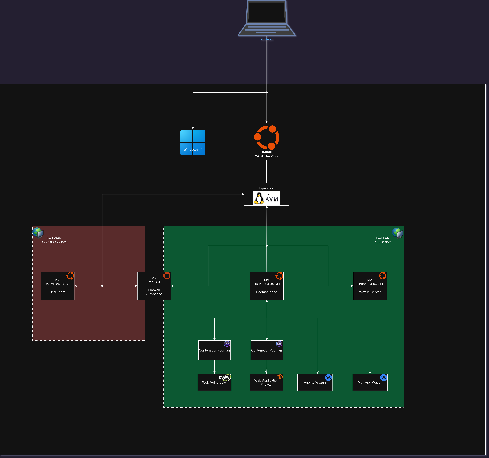

# 🛡️ TFC SecDevOps: Laboratorio de Seguridad y Automatización


## 📌 Descripción del Proyecto
Este repositorio contiene la Infraestructura como Código (IaC) y los flujos de configuración automatizada para el despliegue de un entorno **SecDevOps** completo. Diseñado como Proyecto de Fin de Ciclo (TFC), el laboratorio simula un entorno empresarial segmentado, monitorizado y sometido a pruebas de penetración continuas (Red Team vs Blue Team).

Todo el aprovisionamiento de recursos (KVM/Libvirt) y la configuración del software operativo se realiza de forma **100% desatendida**.

## 🏗️ Topología de Red y Arquitectura


[](./docs/topologia.png)
*Figura 1: Topología lógica y física del laboratorio SecDevOps. Se detalla la segmentación entre la zona WAN (Red Team) y LAN (Blue Team) mediante el firewall OPNsense, así como el anidamiento de contenedores en el nodo víctima.*

Pulsa en el siguiente botón para ir al esquema dinámico de IsoFlow:

[](https://isoflow.io/project/cmp3pprde03mzo41vn8qtiqg5)


El entorno está segmentado mediante un firewall perimetral (OPNsense) que separa el tráfico hostil de la red interna de monitorización.

* **Red Externa (WAN / Red Team):** `192.168.122.0/24`
  * `192.168.122.x` - **Nodo Red Team**: Arsenal de pentesting (Nmap, SQLmap, FFuF). Emula a un atacante externo.
  * `192.168.122.28` - **OPNsense (WAN)**: Interfaz pública del firewall.

* **Red Interna (LAN / Blue Team):** `10.0.0.0/24`
  * `10.0.0.254` - **OPNsense (LAN)**: Puerta de enlace y enrutamiento interno.
  * `10.0.0.10` - **Wazuh Manager**: Cerebro del Blue Team (SIEM/XDR). Recolecta logs y ejecuta respuestas activas (ej. `firewall-drop`).
  * `10.0.0.20` - **Nodo Podman (Víctima)**: Aloja contenedores mediante Quadlets. Contiene una aplicación web vulnerable (DVWA) protegida perimetralmente por un WAF (Nginx + ModSecurity).

## 🚀 Despliegue Automatizado (Quickstart)

El proyecto cuenta con un script que fusiona las fases de provisión (Terraform) y configuración (Ansible), resolviendo las condiciones de carrera y validando la disponibilidad de los puertos antes de inyectar configuraciones.
Este proyecto utiliza el paradigma de Infraestructura como Código (IaC) puro. Antes de lanzar el script de automatización, la máquina host debe cumplir con los siguientes requisitos.

### 🛠️ Prerrequisitos del Sistema (Host)

1. **Herramientas Base:**
   Asegúrate de tener instalados en tu distribución Linux los siguientes paquetes:
   * **Virtualización:** `qemu-kvm`, `libvirt-daemon-system`, `libvirt-clients`, `bridge-utils`.
   * **Orquestación y Configuración:** `terraform`, `ansible`.
   
   *Nota de permisos:* El usuario local debe pertenecer a los grupos `libvirt` y `kvm` para interactuar con el demonio de virtualización sin requerir privilegios de superusuario (`sudo`).

2. **Infraestructura de Claves SSH:**
   Para cumplir con el principio de *Least Privilege* y evitar versionar credenciales, debes generar un par de claves locales. El script de despliegue validará su existencia.
   
   Ejecuta en tu terminal:
   ```bash
   mkdir -p ~/tfc_secdevops/ssh_keys
   ssh-keygen -t ed25519 -f ~/tfc_secdevop/ssh_keys/ssh_tfc_v2 -N "" -C "tfc-secdevops"


### Ejecución

El proyecto cuenta con un script que fusiona las fases de provisión (Terraform) y configuración (Ansible), resolviendo las condiciones de carrera y validando la disponibilidad de los puertos antes de inyectar configuraciones.

```bash
git clone git@github.com:ChristianASIR1/TFC_SecDevOps.git ~/tfc_secdevops && cd ~/tfc_secdevops && chmod +x scripts/despliegue.sh 
cd ~/tfc_secdevops
./scripts/despliegue.sh
